TL;DR: We built `query_condition_cache`, an open-source DuckDB extension that accelerates recurring filtered queries by caching where a predicate may match. When the same predicate appears again, DuckDB can skip table regions already proven empty before accessing their data blocks. That matters because storage I/O often dominates analytical query latency, and at cloud scale, repeatedly reading unnecessary blocks can become a substantial part of the cost of serving queries. Even when the data is already in memory, the cache reduces data movement, decompression, decoding, and repeated predicate evaluation. Its compact, query-driven design is well-suited for repetitive analytical workloads such as monitoring dashboards, log investigation, and recurring read paths.

## Introduction
Monitoring dashboards and log-investigation tools often rerun the same filters over large, continuously growing tables. DuckDB is a natural fit for these embedded analytical workloads: it is lightweight, easy to integrate into applications, and well-suited for interactive and ad hoc analytical queries. However, as users refresh dashboards or refine an investigation, DuckDB may repeatedly evaluate the same predicates over the same data.

To address this problem, we built `query_condition_cache`, a lightweight predicate cache for DuckDB. For frequently reused predicates, it records which table vectors contain qualifying rows, allowing later queries to skip vectors already known to be empty.

## The Problem: Repeated Queries Repeat the Scan Work

Dashboards rarely ask just one question about a log table. One panel might
count matching events:

```sql
SELECT count(*)
FROM logs
WHERE component = 'DataNode'
  OR content LIKE '%Exception%';
```

Another panel might show when those events occurred:

```sql
SELECT date_trunc('hour', timestamp) AS hour, count(*)
FROM logs
WHERE component = 'DataNode'
  OR content LIKE '%Exception%'
GROUP BY hour
ORDER BY hour;
```

Although these queries produce different results, they ask the same underlying
question: which log records either come from `DataNode` or contain an
exception? DuckDB plans and executes each query independently, so the work
performed by one scan does not help the next query answer that question.

### Pushdown Does Not Always Mean Pruning

During a table scan, DuckDB tries to eliminate data from coarse to fine. It
first checks pushed-down filters against the statistics of an entire row
group, then against the finer-grained statistics of individual column
segments. A region that cannot contain a match is skipped before its values
are read or decoded. For filters that can be executed inside the scan, DuckDB
processes the remaining regions one vector at a time and scans the filter
columns first to build a selection vector. If no rows qualify, it can skip the
other projected columns for that vector. Together, statistics pruning and
filter pushdown prevent DuckDB from materializing every projected column before
evaluating the `WHERE` clause.

These optimizations work best when a predicate can be summarized as a range,
but many filters used by dashboards and log investigations cannot. In the
predicate above, `LIKE '%Exception%'` has no fixed prefix that DuckDB can turn
into a range check. The cross-column `OR` makes pruning even harder: DuckDB can
discard a region only when every branch is known to be false. Because the
substring branch cannot be ruled out by statistics, row groups and column
segments may remain candidates even when they ultimately contain no matches.

DuckDB must therefore read the predicate columns and, where necessary,
decompress and decode them before evaluating the expression over each
candidate vector. If the required data blocks are not already in memory, the
scan also incurs storage I/O. Even after the blocks are cached, decoding,
memory traffic, and expression evaluation still consume CPU time. Across many
dashboard panels and refreshes, these costs accumulate: the first scan has
already discovered which vectors are empty, but every later scan must discover
them again.


## Query Condition Cache Design

### Design Goal: Reuse Predicate Knowledge

Query Condition Cache is keyed by the target table and a canonicalized
predicate rather than by a complete query result. For example, in
`SELECT * FROM logs WHERE component = 'DataNode'`, the predicate is
`component = 'DataNode'`. Queries may use different projections, aggregations,
or orderings while still reusing the knowledge learned from evaluating that
predicate.

The cache therefore records a compact summary of where a predicate may produce
rows. Before evaluating the predicate again, DuckDB can consult this summary
and discard scan regions already proven empty. The summary must be fine-grained
enough to avoid unnecessary CPU work and data access, yet small enough to
remain lightweight.

### Canonicalizing Predicate Identity

Raw SQL text is not a reliable cache key because the same predicate can be
written in different ways. For example, these two filters are equivalent:

```sql
component = 'DataNode' OR content LIKE '%Exception%'
content LIKE '%Exception%' OR 'DataNode' = component
```

To give them the same identity, we canonicalize DuckDB's bound expression tree
rather than the original SQL string. We place constants on the right side of a
comparison, flipping the comparison operator when necessary, and sort the
children of `AND` and `OR` expressions into a stable order. We then serialize
the normalized expression with DuckDB's `ToString()` and pair it with the
table OID to form the cache key. As a result, the two predicates above reuse
the same cache entry despite their different syntax.

This is structural canonicalization rather than general logical equivalence.
Predicates involving rewrites we do not recognize may produce separate cache
entries, reducing reuse without changing the query result. In the current
implementation, this reuse
is intended for deterministic predicates whose results remain stable for
unchanged rows. A future version could introduce a stronger predicate-
equivalence checker, potentially by reusing more of DuckDB's expression-
rewrite rules, while ensuring that only predicates proven semantically
equivalent share a cache entry. We leave this extension for future work.

### Choosing a Row-Aligned Cache Unit

DuckDB stores a native table in row groups containing up to 122,880 rows by
default. Within a row group, the data is organized by column, and each column
is divided into physical column segments that hold compressed data. Segment
boundaries depend on the column type, compression method, and encoded values,
so different columns can divide the same logical rows at different positions.
A physical column segment is therefore not a stable shared unit for caching a
predicate that may reference multiple columns.


*Physical column segment boundaries vary by column, so they cannot serve as a shared row-aligned cache unit.*

A row group does provide a common row-aligned boundary, but its granularity is
too coarse. With one cache bit per row group, a single matching row would force
DuckDB to retain all 122,880 rows as possible candidates. We need a smaller
logical unit that remains aligned across every column, regardless of their
physical segment boundaries.

### One Bit per Execution Vector

DuckDB's execution vector provides this shared alignment. A vector represents
a batch of consecutive logical rows. With DuckDB's default
`STANDARD_VECTOR_SIZE` of 2,048 rows, a full 122,880-row row group contains 60
vector-sized ranges. Unlike a physical column segment, range `i` identifies the
same logical rows for every column participating in the predicate.

For each `(table OID, canonical predicate)` pair, Query Condition Cache maps a
row-group index to a fixed-size bitmap:


*One bit records one vector-sized `ROW_ID` range. A set bit may contain a
match; a cleared bit records a range that was observed empty.*

Each bit represents one execution vector. A `1` means that the vector contained
at least one qualifying row during cache construction; a `0` means that the
observed vector contained none. The implementation uses
`std::bitset<VECTORS_PER_ROW_GROUP>`, which contains 60 bits with DuckDB's
default row-group and vector sizes. An all-zero bitmap proves that the entire
cached row group is empty for the predicate, while a row group missing from the
cache remains unknown and must pass through.

### How DuckDB Executes a Query

Before describing where the extension intervenes, it helps to outline DuckDB's
normal query lifecycle. The first half of this lifecycle turns SQL into an
executable plan; the second half runs that plan through vectorized pipelines.

```mermaid
flowchart LR
    subgraph FRONTEND["1 · SQL frontend"]
        direction TB
        A["SQL text"] --> B["Parser"]
        B -->|syntax tree| C["Binder<br/>resolve names and types"]
    end

    subgraph PLANNING["2 · Planning"]
        direction TB
        D["Logical plan<br/>LogicalGet → LogicalFilter → LogicalAggregate"]
        D --> E["Built-in optimizer<br/>pushdown · statistics · rewrites"]
        E --> F["Physical plan"]
    end

    subgraph EXECUTION["3 · Vectorized execution"]
        direction TB
        G["Pipeline builder"] --> P["Pipelines<br/>source → operators → sink"]
        P --> S["Task scheduler"]
        S --> T["Parallel scan tasks<br/>claim row groups · scan vectors"]
        T --> H["Pipeline sink<br/>combine task-local output"]
        H --> J["Dependent pipeline or result"]
    end

    C --> D
    F --> G

    classDef frontend fill:#f7f8fc,stroke:#8993a8,color:#273142,stroke-width:1.25px;
    classDef planning fill:#eef3fb,stroke:#6f8fc9,color:#21395f,stroke-width:1.5px;
    classDef execution fill:#edf7f5,stroke:#568f87,color:#214d48,stroke-width:1.5px;
    class A,B,C frontend;
    class D,E,F planning;
    class G,P,S,T,H,J execution;
```



1. **Parser.** The parser checks the SQL grammar and converts the input text
   into a syntax tree. At this point, names such as `logs` and `component` have
   not yet been connected to catalog objects.

2. **Binder.** The binder resolves tables, columns, functions, and types against
   the catalog. It produces a typed logical plan whose operators describe
   *what* the query must compute, such as `LogicalGet`, `LogicalFilter`, and
   `LogicalAggregate`.

3. **Built-in optimizer.** DuckDB rewrites the logical plan into an equivalent
   but cheaper form. This is where rules such as filter and projection pushdown,
   expression rewrites, and join ordering move or replace logical operators.

4. **Physical planner.** DuckDB converts the optimized logical operators into
   executable physical operators. The logical plan states the required result;
   the physical plan selects the concrete operators that will produce it.

5. **Pipeline builder.** DuckDB organizes the physical operators into one or
   more pipelines. A pipeline has a source that produces data chunks,
   intermediate operators that transform them, and a sink that consumes or
   combines their output. Dependencies determine which pipelines must finish
   before others can start.

6. **Task scheduler and execution.** For each ready pipeline, DuckDB can schedule
   one or more tasks. In a native-table scan pipeline, each task independently
   claims row groups and asks the scan source for the next vector. It pushes
   each vector through the pipeline operators into the sink, then continues
   until the source has no more data.

The optimizer boundary is the useful insertion point for Query Condition
Cache. At that stage, the predicate and target table are known, but the query
has not yet been converted into physical pipelines and tasks.

### Injecting Query Condition Cache into the Lifecycle

Query Condition Cache uses two optimizer-extension callbacks around DuckDB's
built-in optimizer. The pre-optimizer callback captures the complete predicate
and performs the cache lookup. The post-optimizer callback attaches the cache
entry to the optimized table scan. A miss additionally performs a dedicated
parallel build scan before optimization continues.


#### 1. Intercept and Identify the Predicate

The pre-optimizer callback looks for an eligible `LogicalFilter → LogicalGet`
over a native DuckDB table. Running before the built-in optimizer matters
because the complete `WHERE` expression is still available before filter
pushdown can split or rewrite it. The extension canonicalizes this expression
and looks up the cache using `(table OID, canonical predicate)` as the key.

#### 2. Build the Entry on a Miss

On a cache miss, the current implementation performs a synchronous parallel
scan to construct the entry. The
build creates a narrow scan containing only the physical columns referenced by
the predicate and DuckDB's virtual `ROW_ID` column. `ROW_ID` is not stored with
each physical column; DuckDB generates it during the scan to identify the
original position of every row. Each task evaluates the predicate over a
vector, then uses the row IDs of the qualifying rows to locate their row group
and vector:

```text
row_group = ROW_ID / DEFAULT_ROW_GROUP_SIZE
vector    = (ROW_ID % DEFAULT_ROW_GROUP_SIZE) / STANDARD_VECTOR_SIZE
```

In DuckDB's default build, these constants are 122,880 and 2,048 rows,
respectively.

The task sets the corresponding vector bit when at least one row qualifies.
After all parallel tasks finish, their local row-group bitmaps are merged into
the completed cache entry.

#### 3. Store the Predicate Knowledge

The completed entry is stored in DuckDB's per-database `ObjectCache` under the
same table-and-predicate key. A present row group records both matching and
empty vectors, including an all-zero bitmap when the predicate matched nothing
in that row group. Recording all-zero row groups is important because it
distinguishes row groups that were scanned and found empty from those the cache
has not yet observed.

#### 4. Apply the Cache to the Optimized Scan

After DuckDB's built-in optimizer finishes, we use a post-optimizer callback to
add the virtual `ROW_ID` column to the `LogicalGet` and inject
`__condition_cache_filter(ROW_ID)` into its `TableFilterSet`. This allows the
same cache entry to participate in pruning at two levels:

Before scanning a row group, DuckDB checks the cache filter against the row-ID
range of that row group. If every bit in its bitmap is zero, the predicate is
known to match no rows there, so DuckDB can skip the entire row group. Because
this decision is made before reading its data columns, it can also avoid
accessing the corresponding data blocks and therefore reduce storage I/O when
those blocks are not already in memory.

If the row group contains possible matches, DuckDB continues with its normal
vectorized scan. The cache filter maps each vector's row-ID range to the
corresponding bitmap bit. A zero bit rejects the whole vector, allowing DuckDB
to skip data columns that have not yet been scanned for that vector. This can
save decompression, decoding, and predicate-evaluation work. A one bit means
only that the vector may contain a match, so it proceeds through the remaining
filters as usual.

The bitmap is only a pruning guide, not the final predicate result. Matching
and unknown vectors continue through the original predicate evaluation, which
produces the correct query output.

## Evaluation

### Experimental Setup

We evaluate Query Condition Cache on a MacBook Air running macOS 26.5, equipped
with a 10-core Apple M4 processor, 16 GB of unified memory, and a 500 GB Apple
NVMe SSD. The experiments use DuckDB 1.5.4 and `query_condition_cache` at
[this revision](https://github.com/dentiny/duckdb-query-condition-cache/commit/4c5646968531ae816ea929189fed455b6dfed50a).

Our workload uses [HDFS_v2 from
Loghub](https://github.com/logpai/loghub/blob/master/HDFS/README.md#hdfs_v2), a
collection of more than 16 GB of raw logs from a CUHK HDFS deployment with one
NameNode and 32 DataNodes. The logs are unmodified and unlabeled, may contain
both normal and abnormal events, and have some gaps after three nodes were
repaired. After parsing, our benchmark table contains 58,095,613 records,
occupying 17 GB before loading and 6.6 GB as a native DuckDB database.

### Benchmark Protocol

We run ten queries across three log-analysis stories and report the mean ± one
standard deviation over three independent runs. DuckDB chooses its thread
count and memory limit automatically.

Each sample uses a fresh connection. A cold run starts after purging the OS
page cache; a warm run first executes the same query once without timing it.
We measure the cache-disabled **baseline**, the complete **first query** on a
cache miss—including automatic build—and a **cache hit** whose entry is built
outside the timed interval. For a cold cache hit, we purge the OS page cache
again after the build.

### Cold OS Page Cache


*Query latency with a cold OS page cache, in milliseconds (lower is better).
Each timed run starts after an OS page-cache purge. The y-axis is logarithmic.*

| Query | Baseline (ms) | First query (ms) | Cache hit (ms) | Speedup |
|---|---:|---:|---:|---:|
| S1-W1 | 2784.6 ± 4.4 | 4111.1 ± 43.7 | 1283.8 ± 9.9 | 2.17× |
| S1-W2 | 2847.6 ± 36.1 | 4241.8 ± 23.9 | 1354.0 ± 15.1 | 2.10× |
| S1-W3 | 2848.1 ± 6.6 | 4323.2 ± 31.6 | 1334.2 ± 9.2 | 2.13× |
| S1-W4 | 2954.9 ± 13.3 | 3109.3 ± 22.1 | 502.6 ± 4.2 | 5.88× |
| S2-Q1 | 922.6 ± 4.6 | 2904.0 ± 20.7 | 372.3 ± 4.0 | 2.48× |
| S2-Q2 | 973.4 ± 8.5 | 2556.3 ± 16.3 | 76.8 ± 2.2 | 12.67× |
| S2-Q3 | 2584.0 ± 17.7 | 2892.2 ± 41.7 | 345.4 ± 6.5 | 7.48× |
| S3-Q1 | 28.7 ± 1.0 | 79.7 ± 6.4 | 75.7 ± 1.4 | 0.38× |
| S3-Q2 | 194.2 ± 2.2 | 2646.0 ± 6.7 | 135.5 ± 12.6 | 1.43× |
| S3-Q3 | 2542.3 ± 12.7 | 2594.0 ± 43.2 | 86.4 ± 6.3 | 29.42× |

### Warm Storage


*Warm-storage query latency in milliseconds (lower is better). Each query is
executed once without timing before the measurement. The y-axis is
logarithmic.*

| Query | Baseline (ms) | First query (ms) | Cache hit (ms) | Speedup |
|---|---:|---:|---:|---:|
| S1-W1 | 1226.6 ± 8.0 | 2754.4 ± 47.5 | 1304.7 ± 17.0 | 0.94× |
| S1-W2 | 1262.8 ± 16.1 | 2829.7 ± 10.1 | 1326.4 ± 6.0 | 0.95× |
| S1-W3 | 1311.7 ± 38.7 | 3251.7 ± 31.8 | 1367.0 ± 13.9 | 0.96× |
| S1-W4 | 1505.4 ± 6.8 | 1291.0 ± 51.3 | 486.1 ± 8.0 | 3.10× |
| S2-Q1 | 332.3 ± 2.0 | 2326.8 ± 18.5 | 336.9 ± 15.3 | 0.99× |
| S2-Q2 | 341.6 ± 3.5 | 2003.2 ± 7.8 | 24.8 ± 3.7 | 13.77× |
| S2-Q3 | 591.1 ± 27.3 | 1115.2 ± 7.1 | 440.2 ± 2.5 | 1.34× |
| S3-Q1 | 13.5 ± 0.5 | 66.5 ± 0.7 | 20.2 ± 5.6 | 0.67× |
| S3-Q2 | 84.6 ± 10.5 | 2493.5 ± 9.3 | 81.1 ± 14.0 | 1.04× |
| S3-Q3 | 354.3 ± 3.5 | 443.4 ± 24.8 | 34.9 ± 6.1 | 10.15× |

## How to Use

The following walkthrough uses the same
[HDFS_v2](https://github.com/logpai/loghub/blob/master/HDFS/README.md#hdfs_v2)
`logs` table as the evaluation above.

### Install and Load the Extension

Install and load Query Condition Cache from the DuckDB community repository:

```sql
FORCE INSTALL query_condition_cache FROM community;
LOAD 'query_condition_cache';

SET use_query_condition_cache = true;
```

Automatic caching is enabled by default; the explicit `SET` above documents
the behavior expected by the examples.

### Build and Reuse an Entry Automatically

When an eligible predicate has no entry, the first query builds it
automatically and then executes the original plan:

```sql
SELECT count(*) AS exception_rows
FROM logs
WHERE Content LIKE '%Exception%';
```

```text
exception_rows
--------------
492093
```

A later query can reuse the entry even when its projection and aggregation
change, as long as it uses the same table and canonical predicate:

```sql
SELECT Level, count(*) AS exception_rows
FROM logs
WHERE Content LIKE '%Exception%'
GROUP BY Level
ORDER BY Level;
```

```text
Level  exception_rows
-----  --------------
ERROR           23522
INFO             2492
WARN           466079
```

### Inspect the Entry and Cache Usage

`condition_cache_info` reports the coverage of one table-and-predicate entry:

```sql
SELECT *
FROM condition_cache_info('logs', 'Content LIKE ''%Exception%''');
```

| cached_row_groups | total_row_groups | qualifying_vectors | total_vectors |
|---:|---:|---:|---:|
| 175 | 473 | 2,951 | 28,367 |

Here, 175 row groups and 2,951 vector-sized ranges contain at least one
qualifying row. The remaining observed ranges can be skipped when the entry is
reused.

`condition_cache_stats` reports memory use and optimizer lookups across all
entries in the current database instance:

```sql
SELECT * FROM condition_cache_stats();
```

| total_memory_bytes | hit_count | access_count |
|---:|---:|---:|
| 22,816 | 1 | 2 |

The first query caused one miss and built the entry; the second query caused
one hit. Therefore, this session recorded two accesses and one hit.

### Build an Entry Manually

Applications that know their recurring predicates in advance can build an
entry before running the query:

```sql
SELECT *
FROM condition_cache_build(
    'logs',
    'Content LIKE ''%addStoredBlock%'''
);
```

```text
Cache Built: 7779/28367 vectors, 138/473 row groups
```

The entry can be inspected with the same predicate string:

```sql
SELECT *
FROM condition_cache_info(
    'logs',
    'Content LIKE ''%addStoredBlock%'''
);
```

| cached_row_groups | total_row_groups | qualifying_vectors | total_vectors |
|---:|---:|---:|---:|
| 138 | 473 | 7,779 | 28,367 |

### Reset Statistics or Clear the Cache

Resetting statistics clears only the hit and access counters; it leaves cache
entries available for reuse:

```sql
SELECT condition_cache_reset_stats();
```

Disabling automatic caching clears all entries and resets the counters. It can
be enabled again for subsequent queries:

```sql
SET use_query_condition_cache = false;
SET use_query_condition_cache = true;
```

## Conclusion and What's Next

Query Condition Cache reuses predicate knowledge to skip empty vectors while
preserving exact output.

The main limitation is the synchronous cache-miss build, which adds an extra
scan to first-query latency.

We are developing a recorder operator that builds entries as a side effect of
the original scan, removing the dedicated build scan.

Our roadmap also includes:

- Query Condition Cache support for Parquet scans
- Persistent cache entries
- Cleaner cache invalidation
- Probe-side join bitmask caching

Follow [Yun-Tang Chang](https://github.com/Andrewtangtang) and [Hao Jiang](https://github.com/dentiny) for more open-source DuckDB extensions.
